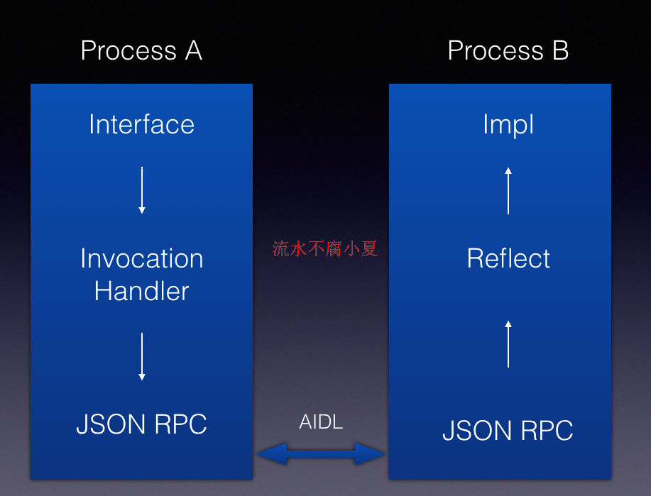

# Bifrost

---
<!-- TOC -->

- [Bifrost](#bifrost)
    - [简介](#简介)
    - [使用方式](#使用方式)
    - [实现原理](#实现原理)
    - [总结](#总结)
    - [后续安排](#后续安排)
    - [相关链接](#相关链接)

<!-- /TOC -->

## 简介

今天上午，看票圈有朋友分享爱奇艺的跨进程通信框架——[Andromeda](https://github.com/iqiyi/Andromeda)，觉的还是有点意思的。
以前项目中用到跨进程这种解决方案比较少，今天看了下Andromeda，发现调用方式很简单。

恰好最近一年都是在做后端工作，想到了Json RPC的方案，其实Android跨进程接也是一种rpc调用方式，那么参考json rpc协议，通过aidl通道也可以很简单一种跨进程通信方式，而且使用方式也很简单。

说干就干，但是作为了高级程序员，肯定要给项目起个名字高大上的名字——Bifrost（彩虹桥），参考复联电影雷神上面的彩虹桥，寓意可以传送到各地，也表达Android跨进程通信可以畅通无阻。

## 使用方式

在Android系统的跨进程调用需要用到AIDL方式，但是呢，操作起来非常麻烦，可以传递基本类型，如果需要自定义类，那么还需要实现`Parcelable`接口，同时也要写不少代码，操作起来繁琐。

像平常一样，先定义一个接口和实现类就行了。

```java
public interface INumberApi {

    int add(int a, int b);
}
```

```java
public class NumberApiImpl implements INumberApi {

    @Override
    public int add(int a, int b) {
        return a + b;
    }
}
```

注册下接口和实现类，因为暂时没有用到依赖注入工具，同时我也不想把功能做的很复杂，暂时手动注册吧，做注册前，先做好初始化工作。

```java
Bifrost.getInstance().init(this);
Bifrost.getInstance().register(IUserApi.class, new UserApiImpl());
Bifrost.getInstance().register(INumberApi.class, NumberApiImpl.class);
```

Bifrost暂时支持2个注册方式，kv都是class类型，还有就是k是class，v是接口实现类的一个对象。

调用方式也很简单。

```java
IUserApi userApi = Bifrost.getInstance().getRemoteInstance(IUserApi.class);
User user = userApi.login("admin", "123456");

Timber.i("user = %s", user);

INumberApi numberApi = Bifrost.getInstance().getRemoteInstance(INumberApi.class);
int ret = numberApi.add(1, 2);

Toast.makeText(getApplicationContext(), "1 + 2 = " + ret, Toast.LENGTH_LONG).show();
```

## 实现原理

原理很简单，见下图所示。



当在原始的进程中，定义一个接口，然后获取该对象的时候，其实返回值是一个用Java动态代理实现的一个值，当有使用方调用接口中的方法时候，会构造成一个`RpcRequest`对象，这个对象很简单，就是标识这个调用的必要信息。

```java
public class RpcRequest {

    @SerializedName("jsonRpc")
    public String jsonRpc = "1.0";

    @SerializedName("id")
    public String id = UUID.randomUUID().toString();

    @SerializedName("clazz")
    public String clazz;

    @SerializedName("method")
    public String method;

    @SerializedName("params")
    public String params;

    @Override
    public String toString() {
        return "RpcRequest{" +
                "jsonRpc='" + jsonRpc + '\'' +
                ", id='" + id + '\'' +
                ", clazz='" + clazz + '\'' +
                ", method='" + method + '\'' +
                ", params='" + params + '\'' +
                '}';
    }
}
```

比如上面的接口方法`INumberApi.add`，那么生成的最终的json信息如下。

```json
{
  "clazz": "cn.mycommons.bifrost.demo.api.INumberApi",
  "id": "0af23e0d-03ab-4cb9-8f52-2c7f7e094023",
  "jsonRpc": "1.0",
  "method": "add",
  "params": "[1,2]"
}
```

然后这个对象又会转化成`Req`对象，这个对象是实现`Parcelable`接口的，用于2个进程之间通信。

```java
public class Req implements Parcelable {

    private String uuid;

    private String payload;

    public Req() {
        uuid = UUID.randomUUID().toString();
    }

    public String getUuid() {
        return uuid;
    }

    public void setUuid(String uuid) {
        this.uuid = uuid;
    }

    public String getPayload() {
        return payload;
    }

    public void setPayload(String payload) {
        this.payload = payload;
    }

    public static Creator<Req> getCREATOR() {
        return CREATOR;
    }

    @Override
    public String toString() {
        return "Req{" +
                "uuid='" + uuid + '\'' +
                ", payload='" + payload + '\'' +
                '}';
    }

    protected Req(Parcel in) {
        uuid = in.readString();
        payload = in.readString();
    }

    public static final Creator<Req> CREATOR = new Creator<Req>() {
        @Override
        public Req createFromParcel(Parcel in) {
            return new Req(in);
        }

        @Override
        public Req[] newArray(int size) {
            return new Req[size];
        }
    };

    @Override
    public int describeContents() {
        return 0;
    }

    @Override
    public void writeToParcel(Parcel dest, int flags) {
        dest.writeString(uuid);
        dest.writeString(payload);
    }
}
```

上面的请求最终的信息变成了这样，这个不是json，是Java的toString方法返回的。

```json
Req{uuid='f6a8028a-3cba-4abf-912b-ee7979923fb5', payload='{"clazz":"cn.mycommons.bifrost.demo.api.INumberApi","id":"0af23e0d-03ab-4cb9-8f52-2c7f7e094023","jsonRpc":"1.0","method":"add","params":"[1,2]"}'}
```

当另外一个进程获取到这些数据后，那么会做对应的反序列化，再次转化成`Req`，然后又可以得到`RpcRequest`。

当取到RpcRequest时候，可以根据里面的信息，获取当前调用接口的实现类，然后利用反射完成调用操作，得到结果后再次把结果转成json。

```java
public class BifrostAidlImpl extends BifrostAidl.Stub {

    private Gson gson = new Gson();

    @Override
    public Resp exec(Req req) throws RemoteException {
        Timber.i("%s-->exec", this);
        Timber.i("req = %s", req);
        String data = req.getPayload();

        RpcRequest rpcRequest = gson.fromJson(data, RpcRequest.class);
        Timber.i("rpcRequest = %s", rpcRequest);

        try {
            Class<?> clazz = Class.forName(rpcRequest.clazz);
            Method method = null;
            for (Method m : clazz.getMethods()) {
                if (m.getName().equals(rpcRequest.method)) {
                    method = m;
                    break;
                }
            }
            if (method != null) {
                Class<?>[] types = method.getParameterTypes();
                List<Object> args = new ArrayList<>();
                if (!TextUtils.isEmpty(rpcRequest.params)) {
                    JSONArray array = new JSONArray(rpcRequest.params);
                    for (int i = 0; i < array.length(); i++) {
                        String o = array.getString(i);
                        args.add(gson.fromJson(o, types[i]));
                    }
                }
                Object instance = Bifrost.getInstance().getInstance(clazz);
                Timber.i("instance = %s", instance);
                Timber.i("method = %s", method);
                Timber.i("types = %s", Arrays.toString(types));
                Timber.i("params = %s", args);
                Object result = method.invoke(instance, args.toArray(new Object[0]));
                Timber.i("result = %s", result);

                return RespUtil.success(req.getUuid(), rpcRequest.id, result);
            }
            throw new RuntimeException("method " + rpcRequest.method + " cant not find");
        } catch (Exception e) {
            Timber.e(e);
            // e.printStackTrace();
            return RespUtil.fail(req.getUuid(), rpcRequest.id, e);
        }
    }
}
```

json也会转成`Resp`，返回到原始的进程。然后解析数据，当做函数返回值。

## 总结

总体来说，这个流程还是蛮清晰的，就是利用一个aidl通道，然后自己定义调用协议，我这边参考了JSON RPC协议。当然了也可以参考其他的，这里不再表述。

整理下优缺点吧：

**优点**

* 使用和调用简单，无上手压力

* 无需实现`Parcelable`接口，代码简洁

**缺点**

* 因为涉及到json转换，所以需要依赖`gson`

* 调用过程中含有多次json序列化与反序列化，有反射操作，可能会有性能影响

* 接口方法中的参数和返回值必须要是基本的类型，支持josn序列化和反序列化，但原始的`AIDL`方式基本上也是一样，所以这条可以接受

## 后续安排

暂时只是实现简单的Demo，只是验证这个思路是否可行，后续会做些优化操作，如有朋友有兴趣，可以一起参与，本人联系方式 xiaqiulei@126.com。

* 支持异步操作，支持回调函数，可参考Retroft调用方式，可支持RxJava操作

* 被调用进程支持线程池，增加并发量

* 单独的日志操作，不依赖Timber

* 支持同进程和夸进程调用

* 支持事件的通知、发送，可参考BroadcastReceiver，EventBus等。

* ....

## 相关链接

[JSON RPC 规范](http://wiki.geekdream.com/Specification/json-rpc_2.0.html)

[Bifrost Github](https://github.com/LiushuiXiaoxia/Bifrost)